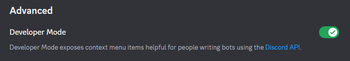
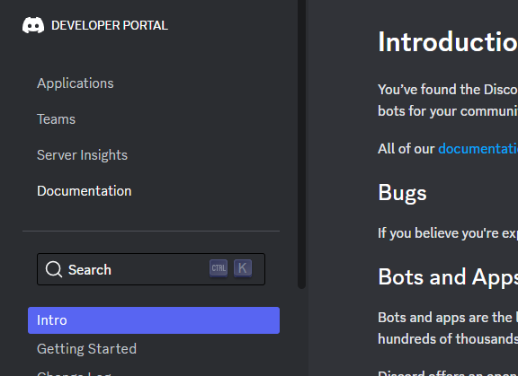
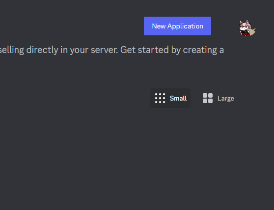
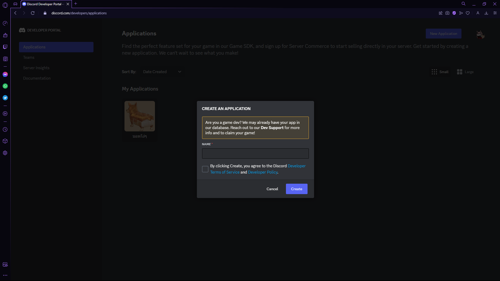
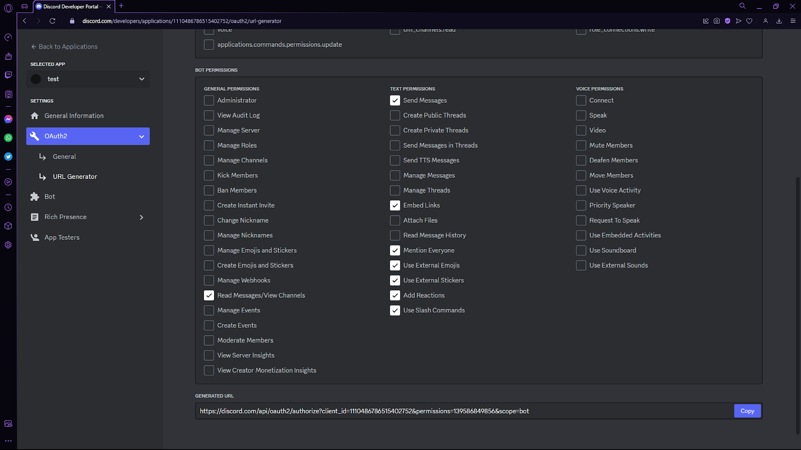
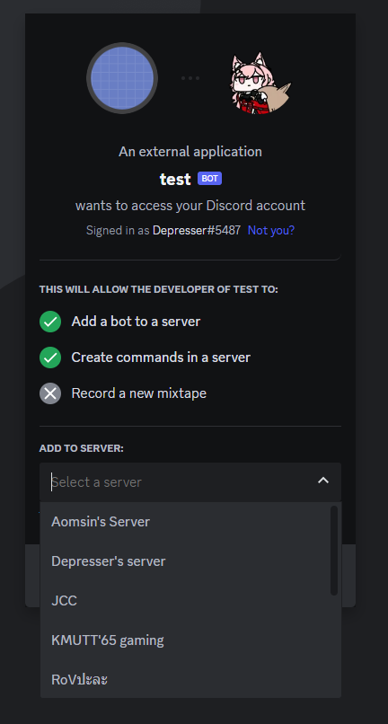
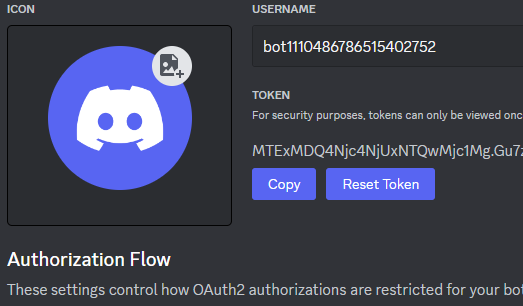

# Virtual Pet Bot


Virtual pet discord bot ที่อาจจะช่วยลดความเครียดโดยการเลี้ยงสัตว์เลี้ยงสุดแปลกบน discord server และยังช่วยส่งเสริมการเรียน, อ่านหนังสือ และทำงานเพื่อหา credits ในการเลี้ยงดูสัตว์เลี้ยงของคุณ


## Table of content

- [Getting started](#getting-started)
- [Features](#features)
- [Commands](#commands)


## Getting started

### Installation

``` bash
git  clone  https://github.com/DRepresser/CSS131-PetBot-project.git

cd  CSS131-PetBot-project

pip  install  -r  requirements.txt
```

### Setup Discord bot

1. ไปที่ user setting ของ discord เลือกไปที่ Advanced แล้วเปิด Developer Mode



2. กดไปที่ Discord API แล้วเข้าไปที่ Applications



3. กด New Application





4. ไปที่ OAuth2 URL Generator เลือก SCOPES เป็น bot และ BOT PERMISSIONS ตามภาพ



5. คัดลอก URL จาก GENERATED URL ไปวางในบราวเซอร์แล้วเลือก server ที่จะเพิ่มบอทเข้าไป



6. ไปที่ Bot แล้วกด Reset Token จากนั้น Copy ไปวางในคำสั่ง



``` bash
echo DISCORD_TOKEN = 'INSERT_YOUR_TOKEN_HERE' > .env
```

### Starting the application

``` bash
python run.py
```


## Commands & Features

- [Create](#create)
- [Status](#status)
- [Balance](#balance)
- [Shop](#shop)
- [Feed](#feed)
- [Play](#play)
- [Work](#study)
- [Release](#release)

### Create

สร้างสัตว์เลี้ยงจากชื่อและสปีชีส์

`!create PET_NAME PET_SPECIES`

**species** จะมีทั้งหมด 2 ชนิด ได้แก่ **Crow** (กา), **Pot** (หม้อ)

### Status

ตรวจสอบค่าสถานะของสัตว์เลี้ยง

`!status`

ค่าสถานะที่ระบุจะมี **Species**, **Hunger**, **Energy**, **Mood**, **Age** และ **Birthdate**

ซึ่ง **Hunger**, **Energy** และ **Mood** จะมึค่าเริ่มต้นอยู่ที่ 50

### Balance

ตรวจสอบจำนวน **Credit** ของตัวเอง

`!balance`

จำนวน **credit เริ่มต้นคือ 100**

### Shop

เปิดร้านค้าประจำวัน ขายอาหารสัตว์เลี้ยงหลายชนิด สินค้าจะถูกเปลี่ยนในทุก ๆ วัน

`!shop`

### Feed

ให้อาหารสัตว์เลี้ยง โดยอาหารที่จะให้ได้จะดูได้จากร้านค้ารายวัน

`!feed ITEM_NAME`

หาก **hunger ของสัตว์เลี้ยงมากกว่า 90** จะไม่สามารถให้อาหารเพิ่มได้อีก

### Play

จ่าย **40 credit** เพื่อเล่นกับสัตว์เลี้ยงของคุณ

`!play`

คุณจะไม่สามารถเล่นกับสัตว์เลี้ยงได่ถ้าหาก **energy ของสัตว์เลี้ยงน้อยกว่า 30**

### Work

ตั้งใจเรียนเพื่อรับ **credit**

`!work TIME_IN_HOUR`

คุณจะได้รับ **70 credit ต่อ 1 ชั่วโมง**

### Release

ปล่อยสัตว์เลี้ยงคืนสู่ป่า

`!release`
